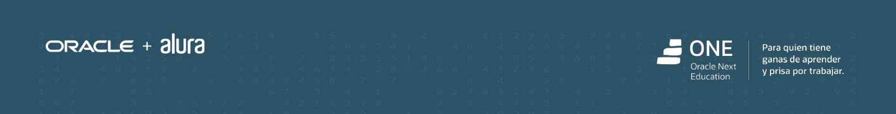
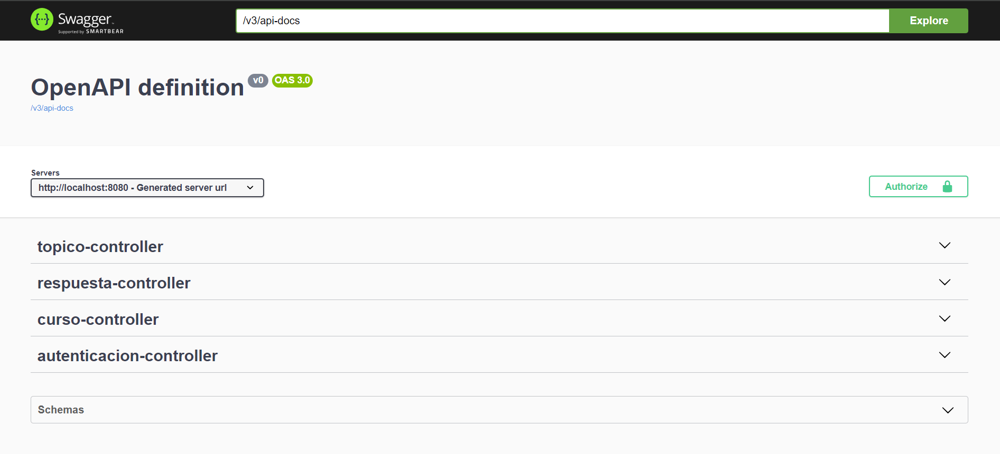
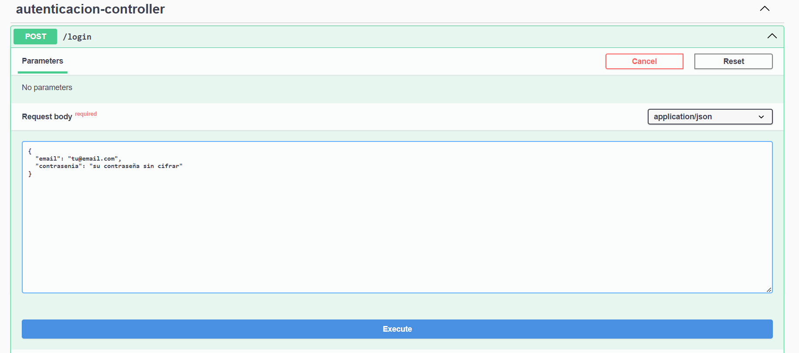
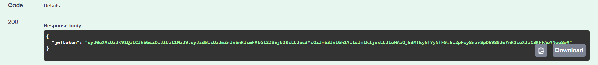
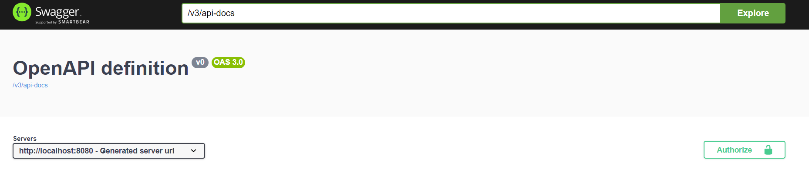
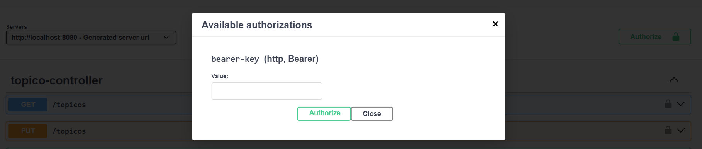
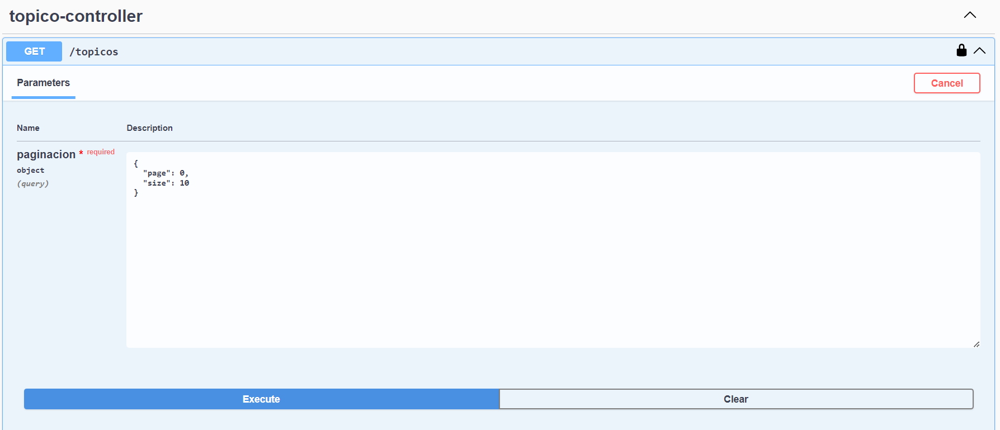
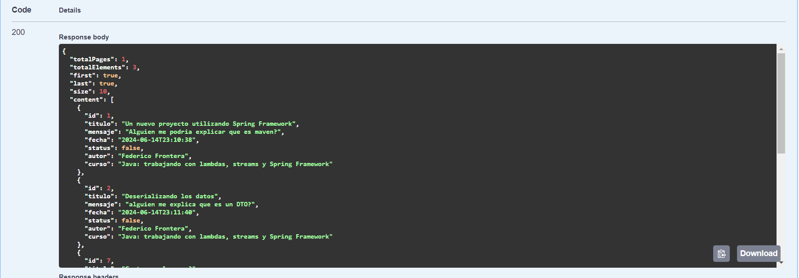

<h1>
  <b>API Rest Foro</b>
</h1>

<h2>
    Desafio planteado por <a href="https://www.aluracursos.com/">Alura latam</a> y <a href="https://www.oracle.com/ar/">Oracle</a> para el progama ONE
</h2>

<h2>
  Informacion sobre el desafio planteado
</h2>

Un foro es un espacio donde todos los participantes de una plataforma pueden plantear sus preguntas sobre determinados tópicos. 
  Aquí en Alura Latam, los estudiantes utilizan el foro para sacar sus dudas sobre los cursos y proyectos en los que participan. 
  Este lugar mágico está lleno de mucho aprendizaje y colaboración entre estudiantes, profesores y moderadores.

  Ya sabemos para qué sirve el foro y conocemos su aspecto, ¿pero sabemos cómo funciona detrás de escena? Es decir, ¿dónde se almacenan las informaciones? 
¿Cómo se tratan los datos para relacionar un tópico con una respuesta, o cómo se relacionan los usuarios con las respuestas de un tópico?

Este es nuestro desafío, llamado ForoHub: en él, vamos a replicar este proceso a nivel de back end y, para eso, crearemos una API REST usando Spring.

  Nuestra API se centrará específicamente en los tópicos, y debe permitir a los usuarios:

<ul>
  <li>
    Crear un nuevo tópico;
  </li>
  <li>
    Mostrar todos los tópicos creados;
  </li>
  <li>
    Mostrar un tópico específico;
  </li>
  <li>
    Mostrar un tópico específico;
  </li>
  <li>
    Actualizar un tópico;
  </li>
  <li>
    Eliminar un tópico.
  </li>
</ul>

  Es lo que normalmente conocemos como CRUD* (CREATE, READ, UPDATE, DELETE) y es muy similar a lo que desarrollamos en LiterAlura, pero ahora de forma completa, 
agregando las operaciones de UPDATE y DELETE, y usando un framework que facilitará mucho nuestro trabajo.

  *Traducción libre (en orden): Crear, Consultar, Actualizar y Eliminar.

  En resumen, nuestro objetivo con este challenge es implementar una API REST con las siguientes funcionalidades:

<ol>
  <li>
    API con rutas implementadas siguiendo las mejores prácticas del modelo REST;
  </li>
  <li>
    Validaciones realizadas según las reglas de negocio;
  </li>
  <li>
    Implementación de una base de datos relacional para la persistencia de la información;
  </li>
  <li>
    Servicio de autenticación/autorización para restringir el acceso a la información.
  </li>
</ol>

<h2>
  Configuraciones del entorno
</h2>

<ul>
  <li>
    Java (versión 17) 
  </li>
  <li>
    Maven (versión 4)
  </li>
  <li>
    Spring Boot (versión 3.3.0)
    Dependencias:
      <ul>
        <li>
          Lombok  
        </li>
        <li>
          Spring Web
        </li>
        <li>
          Spring Boot DevTools
        </li>
        <li>
          Spring Data JPA
        </li>
        <li>
          Flyway Migration
        </li>
        <li>
          MySQL Driver
        </li>
        <li>
          Validation
        </li>
        <li>
          Spring Security
        </li>
      </ul>
  </li>
</ul>

<h2>
    Documentacion
</h2>

    Se implemento Swagger para documentar la aplicación, con el objetivo de generar
    interfaz amigable y accesible.

    Para poder hacer uso de la API es necesario cargar un usuario en bd, por razones de tiempo
no se a generado un end point para realizar tal cosa, por lo tanto debe realizarse de forma la inserción
en la bd "<code>INSERT INTO usuarios (nombre, email, contrasenia)
VALUES ('su nombre', 'su email' , 'contraseña');</code>".
Cabe destacar que la contraseña debe de estar cifrada con BCrypt a la hora de guardarla en la db.

    Una vez realizada la carga de un nuevo usuario, podemos hacer uso de la interface brindada por Swagger
para poder testear el uso de la API.

    Como primer paso, para poder usar la interfaz de Swagger, debemos logearnos con los datos del usuario generado
anteriormente.

    Ir a autenticacion-controller, desplegamos y clickeamos Try it now.
 
Cargamos los datos de login en el request body y clic en Execute.

    Como respuesta obtenemos un estado 200, en cuyo body se encuentra el token generado para poder autenticar las demás 
pruebas.

    Copiamos el token y lo insertamos dentro de Autorize , en el campo value y clickeamos Authorize.

    Ahora estamos listos para usar la API.

    A modo de ejemplo ponemos imagenes de como listar los topicos.

    Request listado de Topicos.

    Response listado de Topicos.

    Cabe destacar que todos los listados estan paginados.

<h2>
    Estado del proyecto
</h2>

<ul>
    <li>
        El desafio planteado por <a href="https://www.aluracursos.com/">Alura latam</a> y <a href="https://www.oracle.com/ar/">Oracle</a> esta completo.
    </li>
    <li>
        Ademas se agregaron end point para: crear, leer, modificar y borrar, tanto cursos, como respuestas.
A modo de desafio personal.
    </li>
</ul>

A modo personal resta generar end point para usuarios y generar autorizacion por roles en toda la API.

